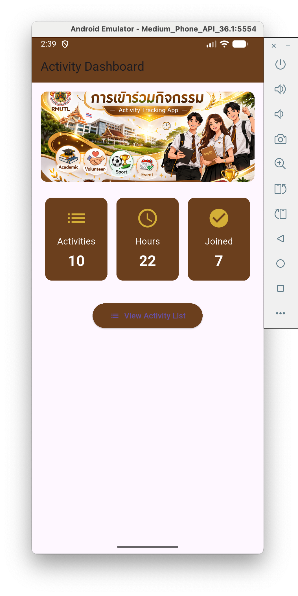
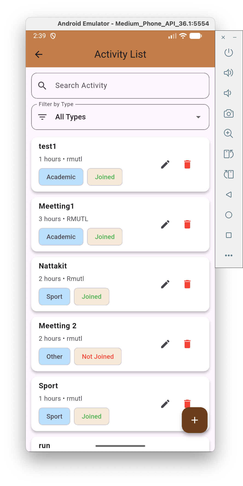
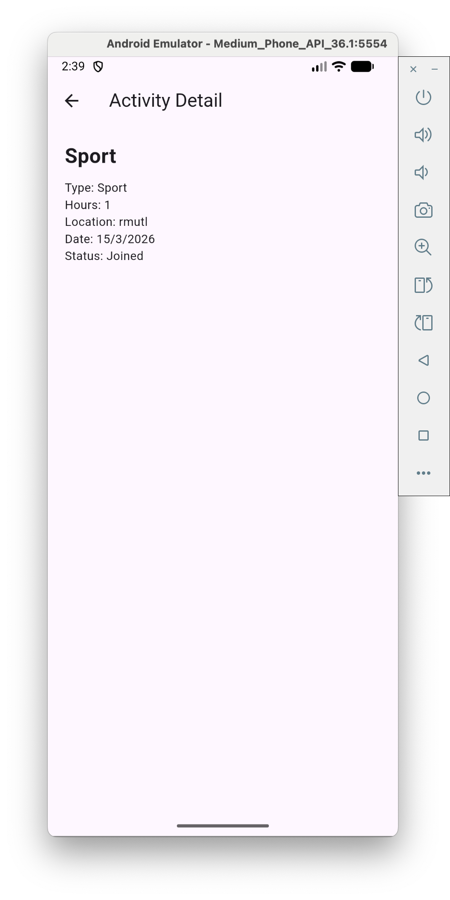
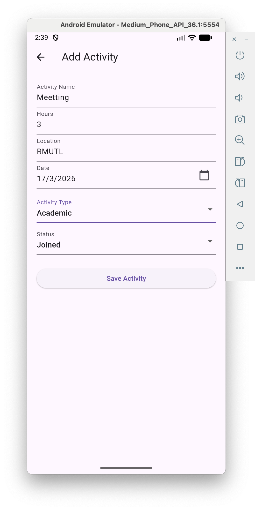

# Activity Tracking App

## ชื่อโจทย์

แอปพลิเคชันบันทึกการเข้าร่วมกิจกรรม (Activity Tracking App)

## ผู้จัดทำ

นาย ณัฐกิตต์ แก้วคำยศ 67543210055-9

---

# รายละเอียดโปรเจกต์

Activity Tracking App เป็นแอปพลิเคชันสำหรับบันทึกและติดตามการเข้าร่วมกิจกรรมของผู้ใช้ ผู้ใช้สามารถเพิ่ม แก้ไข ลบ และดูข้อมูลกิจกรรมที่เข้าร่วม พร้อมทั้งดูสถิติจำนวนกิจกรรม ชั่วโมงรวม และสถานะการเข้าร่วมได้

แอปพัฒนาด้วย **Flutter** และใช้ **SQLite** สำหรับจัดเก็บข้อมูลภายในเครื่อง

---

# ฟังก์ชันของระบบ

### 1. Dashboard

แสดงข้อมูลสรุป

* จำนวนกิจกรรมทั้งหมด
* จำนวนชั่วโมงรวม
* จำนวนกิจกรรมที่เข้าร่วม

### 2. Activity List

* แสดงรายการกิจกรรมทั้งหมด
* ค้นหากิจกรรมจากชื่อ
* กรองกิจกรรมตามประเภท
* แก้ไขกิจกรรม
* ลบกิจกรรม

### 3. Add / Edit Activity

* เพิ่มข้อมูลกิจกรรม
* แก้ไขข้อมูลกิจกรรม

---

# โครงสร้างฐานข้อมูล

ตารางหลัก: **Activity**

| Field  | Type         | Description      |
| ------ | ------------ | ---------------- |
| id     | INTEGER (PK) | รหัสกิจกรรม      |
| name   | TEXT         | ชื่อกิจกรรม      |
| type   | TEXT         | ประเภทกิจกรรม    |
| hours  | INTEGER      | จำนวนชั่วโมง     |
| status | TEXT         | สถานะการเข้าร่วม |
| date   | TEXT         | วันที่           |

---

# ER Diagram (แบบง่าย)

User สามารถบันทึกกิจกรรมได้หลายกิจกรรม

User
↓
Activity

Activity

* id
* name
* type
* hours
* status
* date

---

# Packages ที่ใช้

* provider
* sqflite
* path
* flutter

---

# วิธีรันโปรเจกต์

1. Clone โปรเจกต์

```
git clone <https://github.com/nattakit1/App_Activity_Tracker.git>
```

2. เข้าโฟลเดอร์โปรเจกต์

```
cd flutter_application_final
```

3. ติดตั้ง packages

```
flutter pub get
```

4. รันแอป

```
flutter run
```

---

# เทคโนโลยีที่ใช้

* Flutter
* Dart
* SQLite
* Provider State Management

# 1 Dashboard/Main




# 2 List



# 3 Detail



# 4 Add



# 5 Activity Tracking

